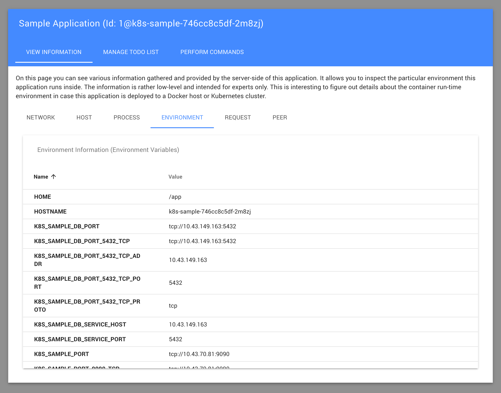

k8s-sample &mdash; Kubernetes Sample Application
================================================

This is a sample application to showcase the oftware deployment on
the container run-time environments [Docker](https://www.docker.com/)
and [Kubernetes (K8S)](https://kubernetes.io/). The
application uses a Rich-Client architecture, comprised of an
[HTML5](https://en.wikipedia.org/wiki/HTML5) Single-Page Application
(SPA) client and a [Node.js](https://nodejs.org/) server and runs
under an arbitrary URL prefix. To showcase important run-time aspects,
the application shows detailed environment information, persists data
(both locally via [SQLite](https://www.sqlite.org/) and remotely
via [PostgreSQL](https://www.postgresql.org/)) and allows one to
control the application process. The application is packaged into a
[Docker](https://www.docker.com/) container and then this container
is deployed onto a [Docker](https://www.docker.com/) run-time
environment via [Docker-Compose](https://docs.docker.com/compose/) and
onto a [Kubernetes](https://kubernetes.io/) run-time environment via
[Helm](https://helm.sh/).

Sneak Preview
-------------



Quick Test-Drive
----------------

For standard contexts:

```sh
$ git clone https://github.com/rse/k8s-sample/          # clone repository
$ cd k8s-sample                                         # enter working copy
$ source 2-env-kubernetes/kubernetes.bash               # etablish Kubernetes environment
$ export KUBECONFIG="<path-to-kube-config>"             # optionally set path to custom access config
$ cd 6-run-kubernetes                                   # enter Kubernetes deployment procedure
$ make install [DATABASE=pgsql]                         # execute Kubernetes deployment procedure
$ open http[s]://<ingress-endpoint>/k8s-sample/         # open deployed application
```

For special msg Project Server (PS) contexts (where `<hostname>` is the
FQDN of the msg Project Server instance):

```sh
$ ssh root@<hostname> docker-stack install ase-k3s      # install K3S Kubernetes distribution
$ git clone https://github.com/rse/k8s-sample/          # clone repository
$ cd k8s-sample                                         # enter working copy
$ source 2-env-kubernetes/kubernetes-ps.bash <hostname> # etablish Kubernetes environment
$ cd 6-runtime-kubernetes                               # enter Kubernetes deployment procedure
$ make install [DATABASE=pgsql]                         # execute Kubernetes deployment procedure
$ open http[s]://<hostname>/ase-k3s/k8s-sample/         # open deployed application
```

Short Background
----------------

On the application development side, the Docker and Kubernetes worlds
are primarily driven by four command-line client programs this
**k8s-sample** is using, too:

|            | low-level<br/>(commands) | high-level<br/>(stacks) |
|----------- | ------------------------ | ----------------------- |
| Docker     | `docker`                 | `docker-compose`        |
| Kubernetes | `kubectl`                | `helm`                  |

The Parts In Detail
-------------------

The **k8s-sample** consts of the following parts:

- **Docker Client Environment**: `1-env-docker`<br/>
  Here you can find scripts for establishing your local Docker
  environment. In order to build and deploy **k8s-sample**, the
  command-line clients for accessing a Docker run-time environment are
  required in steps 4 and 5. Two Bash scripts help you to provision
  those command-line clients locally under Linux (amd64) systems.

  - For local contexts (via `/var/run/docker.sock`):

    ```sh
    $ source 1-env-docker/docker.bash
    ```

  - For remote contexts (via HTTP):

    ```sh
    $ source 1-env-docker/docker.bash
    $ export DOCKER_HOST=tcp://<hostname>:2375
    ```

  - For remote contexts (via HTTPS):

    ```sh
    $ source 1-env-docker/docker.bash
    $ export DOCKER_HOST=tcp://<hostname>:2376
    $ export DOCKER_CERT_PATH="$docker_etcdir"
    $ export DOCKER_TLS_VERIFY=1
    $ cp <path-to-ca-cert>     $DOCKER_CERT_PATH/ca.pem
    $ cp <path-to-client-cert> $DOCKER_CERT_PATH/cert.pem
    $ cp <path-to-client-key>  $DOCKER_CERT_PATH/key.pem
    ```

  - For remote msg Project Server (PS) contexts (where `<hostname>` is the
    hostname of the msg Project Server instance):

    ```sh
    $ source 1-env-docker/docker-ps.bash <hostname>
    ```

- **Kubernetes Client Environment**: `2-env-kubernetes`<br/>
  Here you can find scripts for establishing your local Kubernetes
  environment. In order to deploy **k8s-sample**, the command-line
  clients for accessing a Kubernetes run-time environment are required
  in step 6. Two Bash scripts help you to provision those command-line
  clients locally under Linux (amd64) systems.

  - For local contexts (via existing `~/.kube/config`):

    ```sh
    $ source 2-env-kubernetes/kubernetes.bash
    ```

  - For remote contexts (via custom Kubernetes access configuration):

    ```sh
    $ source 2-env-kubernetes/kubernetes.bash
    $ export KUBECONFIG="<path-to-kube-config>"
    ```

  - For remote msg Project Server (PS) contexts (where `<hostname>` is the
    hostname of the msg Project Server instance) where the K3S Kubernetes
    stack was installed with `docker-stack install ase-k3s` beforehand:

    ```sh
    $ source 2-env-kubernetes/kubernetes-ps.bash <hostname>
    ```

- **Application Source Code**: `3-app-source`<br/>
  Here you can find the sources of the **k8s-sample** HTML5 SPA client and
  the corresponding Node.js server. Only used by you in case you want
  to understand and locally test-drive the application itself.

  ```sh
  $ (cd 3-app-source/fe && make build)
  $ (cd 3-app-source/be && make build start)
  ```

  After this you can access the application under `https://127.0.0.1:9090/`.
  You can stop the application with `CTRL+C`.

- **Application Container Build Procedure**: `4-app-container`<br/>
  Here you can find the procedure for building and packaging the
  **k8s-sample** application as a Docker/OCI container for use in both
  step 5 and 6. Only used by you in case you want to understand the
  Docker/OCI container packaging or build and push the container to
  Docker Hub.

  ```sh
  $ (cd 4-app-container && make build push)
  ```

- **Docker Deployment Procedure**: `5-run-docker`<br/>
  Here you can find the procedure for installing the **k8s-sample**
  container (from step 4) onto a Docker run-time environment via the
  clients docker(1) and docker-compose(1).

  ```sh
  $ (cd 5-run-docker && make install [DATABASE=pgsql])
  ```

  After this you can access the application under `http://<hostname>:9090/`.
  You can uninstall the application again with:

  ```sh
  $ (cd 5-run-docker && make uninstall)
  ```

- **Kubernetes Deployment Procedure**: `6-run-kubernetes`<br/>
  Here you can find the procedure for installing the **k8s-sample**
  container (from step 4) onto a Kubernetes run-time environment via the
  clients kubectl(1) and helm(1).

  ```sh
  $ (cd 6-run-kubernetes && make install [DATABASE=pgsql])
  ```

  After this you can access the application under `http://<endpoint>/k8s-sample/`
  where `<endpoint>` is your Kubernetes ingress endpoint. For a msg Project Server
  with the K3S Kubernetes stack, the URL is `http://<hostname>/ase-k3s/k8s-sample/`
  where `<hostname>` is your msg Project Server instance.
  You can uninstall the application again with:

  ```sh
  $ (cd 6-run-kubernetes && make uninstall)
  ```

